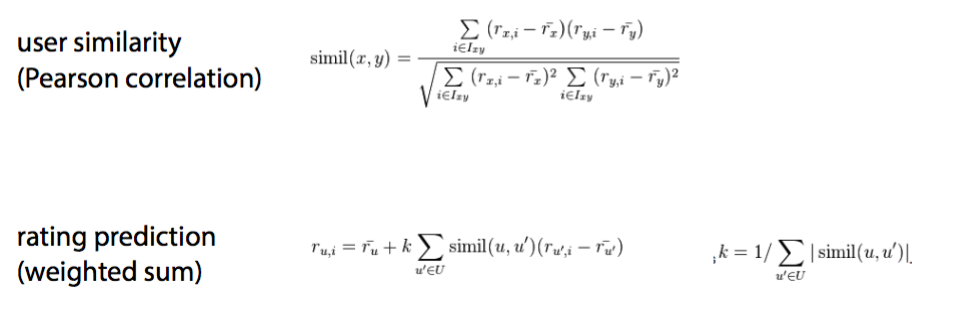

```{r setup, include=FALSE}
knitr::opts_chunk$set(echo = FALSE)
```

```{r Preparations, warning =FALSE,message = F}
setwd("~/Google_Drive/github/R/R_Recap/session_03")
library(dplyr)
library(ggplot2)
require(readr)
```

```{r, warning =F,message = F}
internal_training_values <- read.csv("~/Google_Drive/IE/Machine Learning II/group_assignment/competition_dataset/internal-training-values.csv", na.strings="")
internal_training_labels <- read.csv("~/Google_Drive/IE/Machine Learning II/group_assignment/competition_dataset/internal-training-labels.csv", na.strings="")
df = inner_join(internal_training_values,internal_training_labels,on="id")
rm(list = c("internal_training_values","internal_training_labels"))
df$date_recorded = as.Date(df$date_recorded)

critics <- read_csv("/Users/Felix/Google_Drive/IE/Recommendation Engines/homework/IE-Lab1-Package-O1/Data/critics.csv")
```

# Topics of today
<div class="blue">
- writing / reading files with specific format
- CF 3 recommendation engines
- ggplot2
- handling NAs
- Feature derivation
- kNN
- naive Bayes
- trees
- Random Forests
- Logistic regression
</div>

# writing / reading files with specific format

```{r writing / reading files with specific format, echo = T, warning =FALSE,message = F}
print(help(write.csv))
```
write.table(x, file = "", append = FALSE, quote = TRUE, sep = " ",
            eol = "n", na = "NA", dec = ".", row.names = TRUE,
            col.names = TRUE, qmethod = c("escape", "double"),
            fileEncoding = "")

# CF 3 recommendation engines I
Formulas from class (Introduction to Recommendation Engines, slide 59):


# CF 3 recommendation engines II

```{r, echo = T, warning =FALSE,message = F}
victoria <- critics %>% filter(User=="Victoria") %>% 
  select(-User) %>% as.integer() #from 3
similarity <- critics %>% filter(User != "Victoria"
  ) %>% select(-User) %>% t() %>% cor(.,victoria,use=
  "pairwise.complete.obs",method="pearson") #from 4
avg_rating = critics %>% filter(User!="Victoria"
  ) %>% select(-User)
avg_rating=apply(avg_rating,1,function(x)mean(x,na.rm=T))
avg_victoria = critics %>% filter(User=="Victoria") %>% 
  select(-User) %>% t() %>% mean(.,na.rm = T)
```

# CF 3 recommendation engines III

```{r, echo = T, warning =FALSE,message = F}
critics_no_victoria = critics %>% filter(User != 
  "Victoria") %>% select(-User)
pred_by_movie = vector()
for (i in seq(1:ncol(critics_no_victoria))){
  pred_by_movie[i]=sum(similarity * (
    critics_no_victoria[i]-avg_rating),na.rm=T)
}
#let's normalise the values
rating_calculated <- avg_victoria + (
  (1/sum(abs(similarity))) * pred_by_movie)
movie_names <- names(critics[,-1])
rating_calculated = as.data.frame(cbind(
  rating_calculated,movie_names))
```

# CF 3 recommendation engines IV

```{r, echo = T, warning =FALSE,message = F}
#exclude movies she has already watched
critics_victoria = critics %>% filter(User == "Victoria"
  ) %>% select(-User) %>% t() %>% is.na()
rating_calculated %>% filter(critics_victoria) %>% 
  arrange(.,desc(rating_calculated)) %>% top_n(5,
  rating_calculated)
```


# Possible kinds of feature engineering
<div class="blue">
- Adding values
- Multiplying values
- Decompose Categorical Attributes
- Decompose a Date-Time
- Categories to numeric and the other way around
- PCA
- ML models predicting as a variable (i.e. Bagged trees' predictions)
</div>
More Information: 
http://machinelearningmastery.com/discover-feature-engineering-how-to-engineer-features-
and-how-to-get-good-at-it/

# Decompose a Date-Time {.smaller}

```{r, echo = T, warning =FALSE,message = F}
median(df$date_recorded)
max(df$date_recorded)
min(df$date_recorded)
df$new_date = if_else(df$date_recorded>median
   (df$date_recorded),"recent", "not recent")
head(df$new_date)
```

# Handling NAs

<div class="blue">
- most similar value
- not use the feature
- create a new category for it
- not recommended: exclude instances from sample
- not recommended: do nothing
</div>

# Handling NAs: applied I

```{r, echo = T, warning =FALSE,message = F}
#check for NAs
names = df[,apply(df, 2, function(x) 
  any(is.na(x)))] %>% names()
apply(df[,names], 2, function(x) sum(is.na(x)))
#we handle scheme_name NAs as a new category 
#because NAs reflect about 50% of the data
index = sapply(df$scheme_name,is.na)
levels(df$scheme_name) = c(levels(df$scheme_name),
                           "unknown")
df$scheme_name[index] = "unknown"
```

# Handling NAs: applied II

```{r, echo = T, warning =FALSE,message = F}
get_mode <- function(x) {
  unique_x <- unique(x)
  unique_x[which.max(tabulate(match(x, unique_x)))]
}
#update names
names = df[,apply(df, 2, function(x) 
  any(is.na(x)))] %>% names()
names
```

# Handling NAs: applied III

```{r, echo = T, warning =FALSE,message = F}
df = data.frame(df)
for (name in names){
  mode = get_mode(df[,name])
  index = sapply(df[,name],is.na)
  levels(df[,name]) = c(levels(df[,name]),mode)
  df[index,name] = mode
}
#finished NA handling
print(df[,apply(df, 2, function(x) any(is.na(x)))] 
      %>% names())
```

# ggplot2 I
```{r, echo = T, warning =FALSE,message = F}
ggplot(data = iris, mapping = 
  aes(x=Sepal.Length,y=Sepal.Width))+
  geom_point()
```

# ggplot2 II
```{r, echo = T, warning =FALSE,message = F}
ggplot(data = iris, mapping = 
  aes(x=Sepal.Length,y=Sepal.Width))+
  geom_point(colour = I('red'), size = 3)
```

# ggplot2 III
```{r, echo = T, warning =FALSE,message = F}
ggplot(data = iris, mapping = 
  aes(x=Sepal.Length,y=Sepal.Width,
  color=Species))+
  geom_point()
```

# ggplot2 IV
```{r, echo = T, warning =FALSE,message = F}
ggplot(data = iris, mapping = 
  aes(x=Species))+
  geom_bar(colour=I("black"),fill=I("blue"),size=3)+ 
  coord_flip()
```

# ggplot2 V
```{r, echo = T, warning =FALSE,message = F}
d = diamonds %>% sample_n(100)
ggplot(data = d, mapping = 
  aes(x=cut,y=price))+
  geom_boxplot(colour=I("green"))
```

# ggplot2 VI

```{r, echo = T, warning =FALSE,message = F}
ggplot(data = d, mapping = 
  aes(carat,price,shape=cut))+
  geom_point()
```

# ggplot2 VII

```{r, echo = T, warning =FALSE,message = F}
ggplot(data = d, mapping = 
  aes(carat,price,colour=cut))+
  geom_point()
```

# ggplot2 VIII

```{r, echo = T, warning =FALSE,message = F}
ggplot(data = d, mapping = 
  aes(carat,price,size=cut))+
  geom_point()
```

# ggplot2 IX

```{r, echo = T, warning =FALSE,message = F}
ggplot(data = d, mapping = 
  aes(carat,price))+
  geom_line(colour=I("blue"))+
  geom_abline(intercept = median(d$price))
```

# ggplot2 X

```{r, echo = T, warning =FALSE,message = F}
ggplot(data = diamonds, mapping = 
  aes(price))+
  geom_histogram(colour=I("green"),fill=I("black"),
  bins = 15)
```

# ggplot2 XI

```{r, echo = T, warning =FALSE,message = F}
ggplot(data=mtcars,aes(x=mpg))+
  geom_histogram(aes(y=..density..),binwidth=2.5,
  colour=I("gray")) +
  stat_function(fun=dnorm,args=list(mean=mean(mtcars$mpg),
  sd=sd(mtcars$mpg)),colour=I("red"),size=1.5)
```

# Your turn: model with the wine dataset
Input variables (based on physicochemical tests): 
<div class="blue">
- fixed acidity 
- volatile acidity 
- citric acid 
- residual sugar 
- chlorides 
- free sulfur dioxide 
- total sulfur dioxide 
- density 
- pH 
- sulphates 
- alcohol 
</div>
Output variable (based on sensory data): 
<div class="blue">
- quality (score between 0 and 10)
</div>

# How to download the wine dataset

```{r, echo = T, warning =FALSE,message = F}
url <- 'https://archive.ics.uci.edu/ml/machine-learning-databases/wine-quality/winequality-white.csv'
wine <- read.csv2(url)
glimpse(wine)
```

# kNN
Calculates the distance between data instances.

Good if:
<div class="blue">
- <20 features
- many instances
- non-linear problems
</div>
Watch out if:
<div class="blue">
- too many features (Curse of multidimensionality)
- scale & center before training
</div>
# naive Bayes
Computes the conditional probabilities of an event

Good if:
<div class="blue">
- missing data
- tons of features
</div>
Watch out if:
<div class="blue">
- highly correlated predictors
- use log probabilites for many features
- zero observations problem
</div>
# trees
creates set of rules based on posterior & prior probabilities

Good if:
<div class="blue">
- categorical data
- interpretation necessary
</div>
Watch out if:
<div class="blue">
- many numeric attributes
- trees overfit your data --> pruning!
</div>
# Random Forest
creates several decorrelated decision trees (usually > 100)

Good if:
<div class="blue">
- categorical data
- correlated predictors
- big dataset
</div>
Watch out if:
<div class="blue">
- many numeric attributes
</div>
# Logistic regression
estimates regression coefficients with Maximum Likelihood function

Good if:
<div class="blue">
- instances k>>predictors p
- used for feature selection with ~20-50 predictors
</div>
Watch out if:
<div class="blue">
- too many predictive variables (10k < p)
</div>